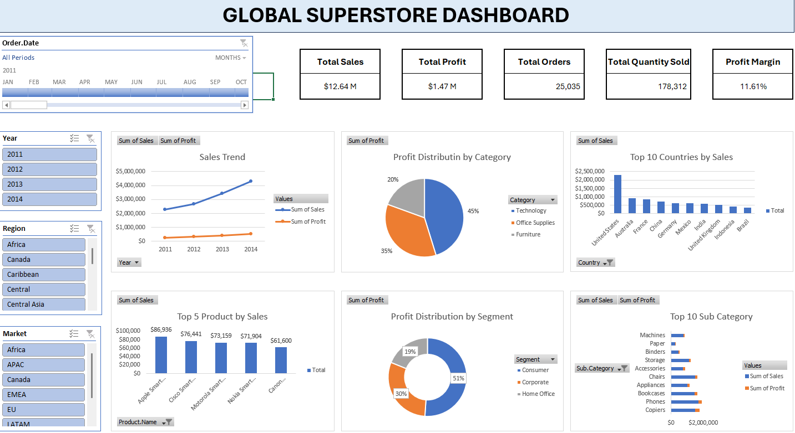

# Global Superstore Sales Analysis Using Excel

## 1. Project Overview

Project ini merupakan analisis performa penjualan menggunakan dataset Global Superstore dengan memanfaatkan Microsoft Excel. Analisis dilakukan untuk memahami kinerja bisnis berdasarkan penjualan, profit, kategori produk, pasar, negara, dan segmen pelanggan. Hasil analisis divisualisasikan dalam bentuk dashboard interaktif untuk membantu pengambilan keputusan berbasis data.

## 2. Objectives

Tujuan dari project ini adalah:

- Menganalisis performa penjualan dan profit perusahaan.
- Mengidentifikasi market dan negara dengan kontribusi terbesar terhadap revenue.
- Menganalisis kategori dan produk yang memberikan profit tertinggi.
- Mengevaluasi dampak diskon terhadap profitabilitas.
- Menyajikan insight bisnis melalui dashboard interaktif menggunakan Microsoft Excel.

## 3. Dataset Information

Dataset yang digunakan dalam project ini adalah Global Superstore Dataset, yang berisi data transaksi penjualan retail global dari berbagai negara dan market. Dataset terdiri dari 51.290 baris data dan 26 kolom yang mencakup informasi pelanggan, produk, penjualan, profit, pengiriman, dan lokasi.

- `Category` =	Kategori utama produk yang dijual (Furniture, Office Supplies, Technology).
- `City` =	Kota tempat pelanggan melakukan pembelian.
- `Country` =	Negara tempat transaksi dilakukan.
- `Customer.ID`	= ID unik untuk setiap pelanggan.
- `Customer.Name` =	Nama pelanggan yang melakukan pembelian.
- `Discount` =	Persentase diskon yang diberikan pada transaksi.
- `Market` =	Wilayah pasar utama tempat transaksi terjadi (APAC, EU, US, LATAM, dll).
- `记录数,` =	Jumlah record (biasanya bernilai 1 untuk setiap transaksi).
- `Order.Date` =	Tanggal pemesanan produk oleh pelanggan.
- `Order.ID` =	ID unik untuk setiap transaksi atau pesanan.
- `Order.Priority` =	Tingkat prioritas pesanan (Low, Medium, High, Critical).
- `Product.ID` =	ID unik untuk setiap produk.
- `Product.Name` =	Nama produk yang dijual.
- `Profit` =	Keuntungan yang diperoleh dari transaksi.
- `Quantity` =	Jumlah unit produk yang terjual dalam transaksi.
- `Region` =	Wilayah geografis yang lebih spesifik dalam suatu negara atau market.
- `Row.ID` =	ID unik untuk setiap baris data.
- `Sales` =	Total nilai penjualan dari transaksi.
- `Segment` =	Segmen pelanggan (Consumer, Corporate, Home Office).
- `Ship.Date` =	Tanggal pengiriman pesanan kepada pelanggan.
- `Ship.Mode` =	Metode pengiriman yang digunakan (Standard Class, First Class, Same Day, dll).
- `Shipping.Cost` =	Biaya pengiriman yang dikeluarkan untuk pesanan.
- `State	Provinsi` = atau negara bagian tempat pelanggan berada.
- `Sub.Category` =	Subkategori produk yang lebih spesifik dalam suatu kategori.
- `Year` =	Tahun transaksi terjadi.
- `Market2` =	Klasifikasi market tambahan yang digunakan dalam dataset.
- `weeknum` =	Nomor minggu dalam satu tahun berdasarkan tanggal transaksi.

## 4. Tools Used
- Microsoft Excel (Pivot Table, Pivot Chart, Slicer, Formula & Functions, Data Cleaning, Dashboard Development)

## 5. Data Cleaning & Preparation

Tahapan data cleaning yang dilakukan meliputi:

1. Missing Value Check

Pengecekan missing value dilakukan menggunakan fitur:

Hasil: Tidak ditemukan missing value pada kolom-kolom utama yang digunakan dalam analisis.

2. Duplicate Data Check

Pengecekan data duplikat dilakukan dengan memvalidasi kombinasi:

- Order ID
- Product ID

Hasil: Tidak ditemukan data transaksi duplikat.

3. Data Formatting

Beberapa penyesuaian format data yang dilakukan:

- Order Date → Date Format
- Ship Date → Date Format
- Sales → Currency Format
- Profit → Currency Format
- Discount → Percentage Format
- Feature Engineering

4. Membuat kolom baru

Membuat kolom `Profit Margin` untuk menghitung tingkat profitabilitas setiap transaksi menggunakan rumus:`Profit Margin` = `Profit` ÷ `Sales`

## 6. Exploratory Data Analysis
Exploratory Data Analysis (EDA) dilakukan untuk memahami pola, tren, dan hubungan antar variabel dalam dataset sebelum membangun dashboard. Tahapan ini bertujuan untuk mengidentifikasi peluang bisnis, mengevaluasi performa penjualan, dan menemukan insight yang dapat mendukung pengambilan keputusan berbasis data.

Dalam project ini, EDA dilakukan menggunakan Pivot Table dan Pivot Chart di Microsoft Excel.

1. Sales Trend Analysis

Analisis dilakukan untuk mengevaluasi perkembangan penjualan dari tahun ke tahun.

Tujuan
- Mengidentifikasi tren pertumbuhan penjualan.
- Mengetahui apakah penjualan mengalami peningkatan atau penurunan selama periode analisis.

2. Profit Trend Analysis

Analisis profit dilakukan untuk memahami perkembangan keuntungan perusahaan dari waktu ke waktu.

Tujuan
- Mengukur pertumbuhan profit perusahaan.
- Membandingkan tren profit dengan tren penjualan.

3. Sales by Market Analysis

Analisis kontribusi penjualan berdasarkan market atau wilayah bisnis.

Tujuan
- Mengidentifikasi market dengan kontribusi revenue terbesar.
- Membandingkan performa penjualan antar market.

4. Profit by Market Analysis

Analisis profit berdasarkan market.

Tujuan
- Menentukan market yang paling menguntungkan.
- Mengevaluasi efektivitas strategi bisnis di setiap market.

5. Profit Margin by Market Analysis

Analisis profit margin untuk mengukur efisiensi profitabilitas setiap market.

Tujuan
- Mengetahui market dengan tingkat profitabilitas terbaik.
- Mengidentifikasi market dengan revenue tinggi namun margin rendah.

6. Sales by Category Analysis

Analisis performa penjualan berdasarkan kategori produk.

Tujuan
- Menentukan kategori produk dengan penjualan tertinggi.
- Mengidentifikasi kategori yang paling diminati pelanggan.

7. Profit by Category Analysis

Analisis profit berdasarkan kategori produk.

Tujuan
- Menentukan kategori yang menghasilkan keuntungan terbesar.
- Membandingkan kontribusi profit antar kategori.

8. Sub-Category Performance Analysis

Analisis performa berdasarkan subkategori produk.

Tujuan
- Mengidentifikasi subkategori dengan performa terbaik.
- Menemukan subkategori yang berpotensi menjadi fokus bisnis.

9. Top 10 Countries by Sales

Analisis negara dengan kontribusi penjualan terbesar.

Tujuan
- Mengidentifikasi pasar utama perusahaan.
- Mengetahui negara yang memberikan kontribusi revenue tertinggi.

10. Top 10 Countries by Profit

Analisis negara dengan profit terbesar.

Tujuan
- Menentukan negara yang paling menguntungkan.
- Membandingkan revenue dan profit antar negara.

11. Top 10 Products by Sales

Analisis produk dengan penjualan tertinggi.

Tujuan
- Mengetahui produk paling populer.
- Mengidentifikasi produk yang menjadi penggerak utama revenue.

12. Top 10 Products by Profit

Analisis produk dengan profit tertinggi.

Tujuan
- Menentukan produk yang memberikan kontribusi keuntungan terbesar.
- Mengidentifikasi produk bernilai tinggi bagi perusahaan.

13. Bottom 10 Products by Profit

Analisis produk dengan profit terendah.

Tujuan
- Mengidentifikasi produk yang memberikan profit rendah atau negatif.
- Menemukan peluang perbaikan strategi harga atau promosi.

14. Discount Impact Analysis

Analisis hubungan antara diskon dan profitabilitas.

Tujuan
- Mengevaluasi dampak pemberian diskon terhadap profit perusahaan.
- Mengetahui apakah diskon yang tinggi menghasilkan profit yang lebih baik.

15. Customer Segment Analysis

Analisis performa berdasarkan segmen pelanggan.

Tujuan
- Mengidentifikasi segmen pelanggan yang memberikan kontribusi terbesar terhadap revenue dan profit.
- Membandingkan karakteristik masing-masing segmen pelanggan.

## 7. Dashboard

## 8. Key Insight
### 1. Sales dan Profit Menunjukkan Tren Pertumbuhan yang Konsisten

Analisis tren penjualan menunjukkan bahwa perusahaan mengalami pertumbuhan yang stabil selama periode 2011–2014. Total sales meningkat dari $2,26M pada tahun 2011 menjadi $4,30M pada tahun 2014. Sejalan dengan itu, profit juga meningkat dari $248K menjadi $504K.

Insight:
Pertumbuhan sales yang diikuti oleh peningkatan profit mengindikasikan bahwa perusahaan berhasil memperluas bisnis sekaligus mempertahankan profitabilitasnya.

### 2. Technology Menjadi Kategori Paling Menguntungkan

Berdasarkan analisis profit per kategori, Technology menyumbang sekitar 45% dari total profit perusahaan, diikuti oleh Office Supplies sebesar 35%, dan Furniture sebesar 20%.

Insight:
Kategori Technology merupakan kontributor utama profit perusahaan dan memiliki performa yang lebih baik dibandingkan kategori lainnya.

### 3. United States Menjadi Kontributor Revenue Terbesar

Analisis Top 10 Countries by Sales menunjukkan bahwa United States menghasilkan revenue sebesar $2,30M, jauh lebih tinggi dibandingkan negara lainnya seperti Australia, France, dan China.

Insight:
Perusahaan sangat bergantung pada pasar Amerika Serikat sebagai sumber utama pendapatan, sehingga performa bisnis secara keseluruhan sangat dipengaruhi oleh kondisi pasar tersebut.

### 4. Segmen Consumer Mendominasi Profit Perusahaan

Analisis distribusi profit berdasarkan segmen pelanggan menunjukkan bahwa:

Consumer: 51%
Corporate: 30%
Home Office: 19%

Insight:
Segmen Consumer merupakan sumber profit terbesar dan menjadi target pelanggan yang paling berkontribusi terhadap kinerja bisnis perusahaan.

### 5. Copiers Menjadi Subkategori dengan Profit Tertinggi

Analisis subkategori produk menunjukkan bahwa Copiers menghasilkan profit tertinggi sebesar $258K, diikuti oleh Phones sebesar $217K dan Bookcases sebesar $162K.

Insight:
Meskipun bukan subkategori dengan penjualan tertinggi, Copiers mampu menghasilkan keuntungan terbesar sehingga memiliki nilai bisnis yang sangat tinggi.

### 6. Phones Menjadi Subkategori dengan Penjualan Tertinggi

Berdasarkan analisis penjualan per subkategori, Phones mencatat total sales sebesar $1,71M, tertinggi dibandingkan subkategori lainnya.

Insight:
Tingginya nilai sales dan profit pada subkategori Phones menunjukkan adanya permintaan pasar yang kuat serta kontribusi yang signifikan terhadap pertumbuhan bisnis.

### 7. Beberapa Subkategori Memiliki Profit Relatif Rendah

Subkategori seperti Paper, Binders, dan Machines menunjukkan profit yang jauh lebih rendah dibandingkan subkategori lainnya.

Insight:
Performa profit yang rendah mengindikasikan adanya peluang untuk melakukan evaluasi terhadap strategi harga, biaya operasional, maupun efektivitas promosi pada subkategori tersebut.

## 9. Bussiness Recomendation
### 1. Meningkatkan Fokus pada Kategori Technology

Karena kategori Technology memberikan kontribusi profit terbesar, perusahaan dapat meningkatkan investasi pada kategori ini melalui perluasan variasi produk, peningkatan aktivitas pemasaran, dan optimalisasi ketersediaan stok.

Expected Impact:
Meningkatkan profit perusahaan dengan memanfaatkan kategori yang telah terbukti memiliki profitabilitas tinggi.

### 2. Mengoptimalkan Penjualan Produk Phones dan Copiers

Subkategori Phones dan Copiers menunjukkan performa terbaik dari sisi sales maupun profit.

Strategi yang dapat diterapkan:

- Menjalankan promosi khusus untuk produk unggulan.
- Menawarkan paket bundling produk.
- Menjaga ketersediaan stok produk dengan permintaan tinggi.

Expected Impact:
Meningkatkan revenue dan profit melalui produk-produk dengan performa terbaik.

### 3. Diversifikasi Pendapatan ke Negara Potensial Lain

Ketergantungan yang tinggi terhadap pasar Amerika Serikat dapat meningkatkan risiko bisnis.

Strategi yang dapat dilakukan:

- Memperkuat penetrasi pasar di Australia, France, dan China.
- Menyesuaikan strategi pemasaran sesuai karakteristik masing-masing negara.
- Mengembangkan peluang bisnis pada market dengan pertumbuhan tinggi.

Expected Impact:
Mengurangi ketergantungan pada satu pasar dan menciptakan sumber pendapatan yang lebih beragam.

### 4. Meningkatkan Kontribusi Segmen Corporate dan Home Office

Saat ini profit masih didominasi oleh segmen Consumer.

Strategi yang dapat dilakukan:

Menawarkan program loyalitas untuk pelanggan bisnis.
Menyediakan paket produk yang sesuai dengan kebutuhan perusahaan dan pekerja profesional.
Mengembangkan strategi pemasaran yang lebih spesifik untuk segmen Corporate dan Home Office.

Expected Impact:
Meningkatkan kontribusi profit dari segmen pelanggan yang saat ini masih memiliki potensi pertumbuhan.

### 5. Melakukan Evaluasi terhadap Produk dengan Profit Rendah

Subkategori seperti Paper, Binders, dan Machines memerlukan perhatian lebih lanjut untuk meningkatkan profitabilitasnya.

Strategi yang dapat dilakukan:

Meninjau kembali struktur harga produk.
Mengevaluasi efektivitas diskon dan promosi.
Mengurangi biaya operasional yang tidak efisien.

Expected Impact:
Meningkatkan margin keuntungan dan mengoptimalkan performa produk dengan profit rendah.
